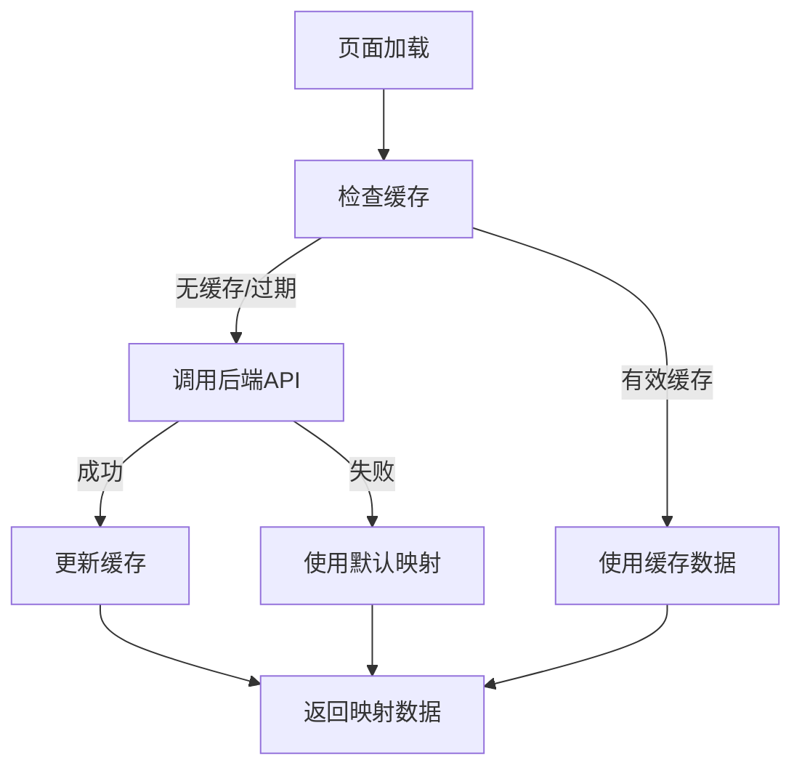
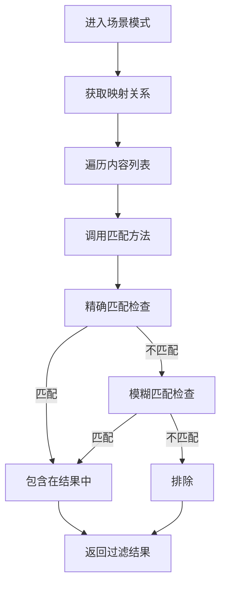

# 场景映射动态实现方案

## 🎯 问题背景

用户反馈现有的场景分类映射关系是硬编码的，评测量表和音乐脑波与场景的对应关系缺乏灵活性，应该从后端动态获取映射关系。

### 原有问题

1. **硬编码映射**：通过固定的字段匹配实现过滤，如 `scale.scale_type === sceneContext.scaleType`
2. **缺乏标准化**：没有统一的映射规则和API接口
3. **维护困难**：映射关系变更需要修改前端代码
4. **匹配不准确**：简单的字符串匹配容易遗漏相关内容

## 🔧 解决方案

### 1. 场景映射服务 (SceneMappingService)

创建了 `utils/sceneMappingService.js`，提供统一的映射管理功能：

#### 核心功能
```javascript
// 获取场景对应的评测量表类型
await sceneMappingService.getScaleTypesByScene(sceneId, sceneName)

// 获取场景对应的音乐类型
await sceneMappingService.getMusicTypesByScene(sceneId, sceneName)

// 判断评测量表是否匹配场景
await sceneMappingService.isScaleMatchingScene(scale, sceneId, sceneName)

// 判断音乐是否匹配场景
await sceneMappingService.isMusicMatchingScene(music, sceneId, sceneName)
```

#### 特性
- **智能缓存**：5分钟内复用映射数据，减少API调用
- **后备方案**：API失败时使用默认映射关系
- **多重匹配**：支持精确匹配和模糊匹配
- **双重索引**：支持场景ID和场景名称查找

### 2. 后端API接口

在 `utils/healingApi.js` 中新增 `SceneMappingAPI`：

```javascript
const SceneMappingAPI = {
  // 获取所有场景映射关系
  getMappings() {
    return get('/scene/mappings')
  },
  
  // 根据场景ID获取评测量表类型
  getScaleTypesByScene(sceneId) {
    return get(`/scene/${sceneId}/scale-types`)
  },
  
  // 根据场景ID获取音乐类型
  getMusicTypesByScene(sceneId) {
    return get(`/scene/${sceneId}/music-types`)
  }
}
```

### 3. 前端页面更新

#### 评测量表页面 (`pages/assessment/scales/scales.js`)

**原实现**：
```javascript
// 简单字段匹配
const filtered = scales.filter(scale => 
  scale.scale_type === sceneContext.scaleType
)
```

**新实现**：
```javascript
// 动态映射服务
const filteredPromises = scales.map(scale => 
  sceneMappingService.isScaleMatchingScene(
    scale, 
    sceneContext.sceneId, 
    sceneContext.sceneName
  )
)
const matchResults = await Promise.all(filteredPromises)
const filtered = scales.filter((scale, index) => matchResults[index])
```

#### 音乐库页面 (`pages/music/library/library.js`)

**原实现**：
```javascript
// 基于固定字段的模糊匹配
const brainwaveScaleType = brainwave.assessment_scale_name || 
                          brainwave.scale_type || 
                          brainwave.scale_name
if (brainwaveScaleType === sceneContext.scaleType) {
  return true
}
```

**新实现**：
```javascript
// 使用映射服务的智能匹配
const musicFilterPromises = musicList.map(music => 
  sceneMappingService.isMusicMatchingScene(
    music,
    sceneContext.sceneId,
    sceneContext.sceneName
  )
)
```

## 📊 默认映射关系

当后端API不可用时，系统使用以下默认映射：

### 场景到评测量表映射
```javascript
sceneToScales: {
  1: ['HAMD', 'HAMD-17'],     // 抑郁疗愈
  2: ['HAMA', 'GAD-7'],       // 焦虑缓解  
  3: ['PSQI'],                // 睡眠改善
  4: ['PSS'],                 // 压力释放
  5: ['WHOQOL']               // 生活质量
}
```

### 场景到音乐类型映射
```javascript
sceneToMusic: {
  1: ['HAMD', 'depression', 'mood_lifting'],      // 抑郁疗愈
  2: ['HAMA', 'anxiety', 'calming'],              // 焦虑缓解
  3: ['PSQI', 'sleep', 'relaxation'],             // 睡眠改善
  4: ['PSS', 'stress_relief', 'relaxation'],      // 压力释放
  5: ['mood_regulation', 'emotional_balance']     // 情绪调节
}
```

## 🔄 工作流程

### 1. 数据获取流程


### 2. 过滤流程


## 🎯 优势

### 1. 灵活性
- **动态配置**：映射关系可在后端配置，无需发版
- **多维匹配**：支持ID、名称、标签等多种匹配方式
- **扩展性**：易于添加新的场景和映射规则

### 2. 性能
- **智能缓存**：减少重复API调用
- **并行处理**：使用Promise.all并行检查匹配
- **优雅降级**：API失败时无缝切换到默认规则

### 3. 用户体验
- **精准过滤**：基于专业映射关系的准确过滤
- **一致性**：统一的过滤逻辑和用户界面
- **透明度**：清晰的场景模式指示和退出选项

## 🚀 后续扩展

### 1. 后端API实现建议
```javascript
// 后端API返回格式示例
{
  "success": true,
  "data": {
    "sceneToScales": {
      "1": ["HAMD", "HAMD-17"],
      "2": ["HAMA", "GAD-7"]
    },
    "sceneToMusic": {
      "1": ["HAMD", "depression", "mood_lifting"],
      "2": ["HAMA", "anxiety", "calming"]
    },
    "lastUpdated": "2025-09-20T10:30:00Z",
    "version": "1.0"
  }
}
```

### 2. 监控和调试
- **调试信息**：通过 `sceneMappingService.getDebugInfo()` 获取状态
- **日志记录**：详细的匹配过程日志
- **性能监控**：缓存命中率和API响应时间

### 3. 配置管理
- **版本控制**：映射关系版本管理
- **A/B测试**：不同映射策略的效果对比
- **实时更新**：支持映射关系的热更新

## 📝 测试计划

### 1. 单元测试
- 映射服务的各个方法
- 缓存机制的正确性
- 默认映射的准确性

### 2. 集成测试
- 页面过滤功能的完整流程
- API调用和错误处理
- 用户界面的响应性

### 3. 用户测试
- 场景模式的使用体验
- 过滤结果的准确性
- 性能表现

## 🔧 维护指南

### 1. 映射规则更新
- 在后端管理系统中配置新的映射关系
- 测试映射效果
- 发布更新

### 2. 问题排查
- 检查API响应状态
- 查看缓存状态：`sceneMappingService.getDebugInfo()`
- 清除缓存：`sceneMappingService.clearCache()`

### 3. 性能优化
- 监控API响应时间
- 调整缓存过期时间
- 优化映射匹配算法

---

**创建时间**: 2025-09-20  
**版本**: 1.0  
**状态**: 已实现  
**负责人**: AI Assistant  
